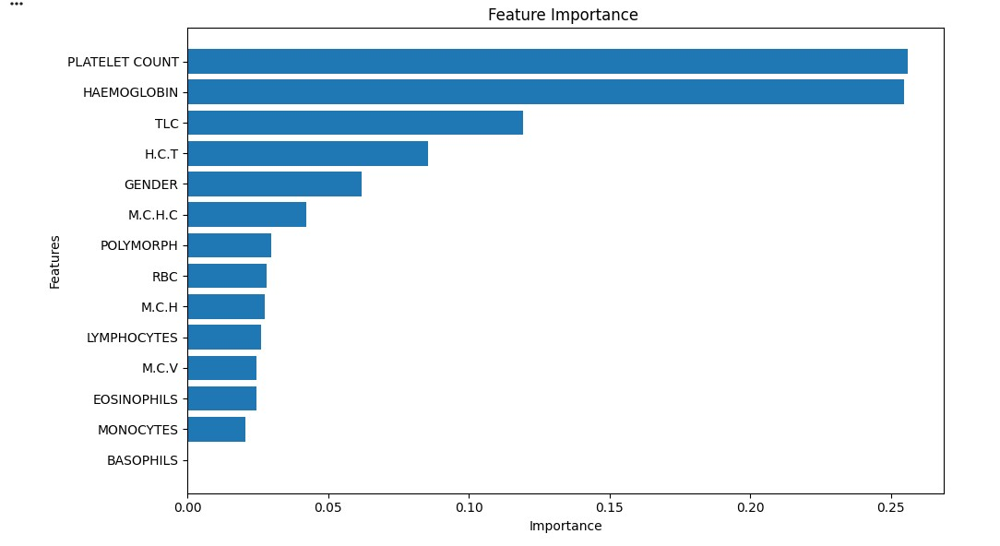
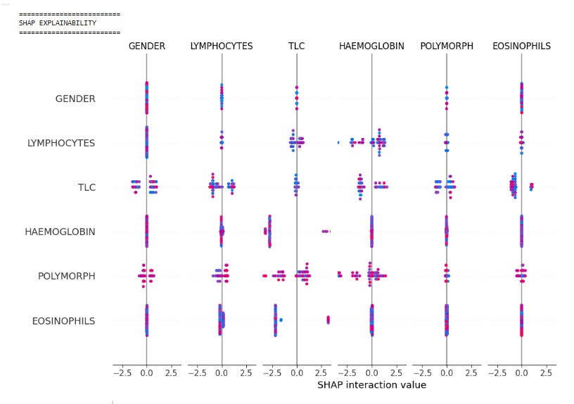

# 🩺 CBC Report Analyzer using Machine Learning & Explainable AI


## 📌 Overview

CBC Report Analyzer is a Machine Learning based project that analyzes **Complete Blood Count (CBC)** parameters and provides an interpretable assessment of health severity.

The objective of this project is to build an ML pipeline that not only predicts outcomes but also explains **why a prediction was made** using Explainable AI techniques.

---

## 🎯 Problem Statement

Medical reports contain multiple parameters that are difficult to interpret without expert knowledge.

This project aims to:

- Analyze CBC parameters
- Identify important health indicators
- Predict severity levels
- Provide transparent model explanations using SHAP

---

## 📓 Notebook

You can find the complete analysis notebook here:

[CBC Report Analyzer Notebook](CBC_Report_Analyzer.ipynb)

---

## 🔄 Project Workflow

```
CBC Dataset
      |
      ↓
Data Cleaning
      |
      ↓
Exploratory Data Analysis
      |
      ↓
Feature Engineering
      |
      ↓
Machine Learning Model
      |
      ↓
Severity Prediction
      |
      ↓
SHAP Explainability
```

---

## 🛠️ Technologies Used

| Category | Tools |
|----------|-------|
| Programming | Python |
| Data Processing | Pandas, NumPy |
| Visualization | Matplotlib, Seaborn |
| Machine Learning | Scikit-learn |
| Explainable AI | SHAP |
| Development | Jupyter Notebook |

---

## 🔍 Methodology

### 1. Data Preprocessing

- Data cleaning
- Handling missing values
- Feature selection
- Feature scaling

### 2. Exploratory Data Analysis

Performed analysis to understand:

- Feature distribution
- Correlation between parameters
- Important health indicators

### 3. Model Development

Steps followed:

- Dataset splitting
- Model training
- Performance evaluation
- Prediction generation

### 4. Explainable AI

Used **SHAP (SHapley Additive exPlanations)** to understand:

- Feature contribution
- Important CBC parameters
- Model decision-making process

---

## 📊 Results & Insights

Key outcomes:

✅ Built an end-to-end ML workflow  
✅ Developed a predictive system using CBC parameters  
✅ Added interpretability using SHAP  
✅ Identified important features influencing predictions  

---

## 📈 Visualizations

### Feature Importance




### SHAP Analysis



---

## 🚀 Future Improvements

- Deploy as a web application
- Integrate real-time CBC report upload
- Improve prediction accuracy with larger datasets
- Add medical recommendation module
